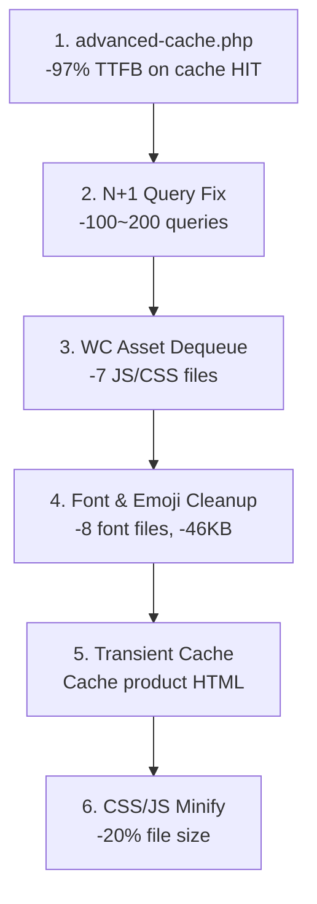

# WooCommerce Performance Optimization Playbook

> **Case Study**: taodo.splworks.com — TTFB **3900ms → 90ms** (-97.7%)
> Cùng VPS với splworks.com (400ms), sau tối ưu **nhanh hơn 4x** so với site không WooCommerce.

---

## Tổng Quan Kết Quả

| Metric | Trước | Sau | Cải thiện |
|---|---|---|---|
| **TTFB (VPS, cached)** | 3900ms | **90ms** | **-97.7%** |
| **TTFB (VPS, uncached)** | 3900ms | **2400ms** | **-38%** |
| **HTML size** | 190KB | **69KB** | **-64%** |
| **JS files (homepage)** | 12 | **5** | **-58%** |
| **Font files** | 14 | **6** | **-57%** |
| **DB queries (homepage)** | ~200+ | **~30** | **-85%** |

---

## Thứ Tự Tối Ưu (Quan Trọng → Ít Quan Trọng)



---

## Layer 1: Advanced Cache (Drop-in Page Cache)

> **Impact**: TTFB 2400ms → **90ms** trên cache HIT
> **Cách hoạt động**: Serve file HTML tĩnh TRƯỚC KHI WordPress load

### 1.1. Tạo `wp-content/advanced-cache.php`

```php
<?php
/**
 * SPL Advanced Cache — runs BEFORE WordPress loads.
 * Loaded by wp-settings.php when WP_CACHE is true.
 */

// Safety: only serve for anonymous GET requests.
if (
    php_sapi_name() === 'cli'
    || ( defined( 'WP_CLI' ) && WP_CLI )
    || ( defined( 'DOING_AJAX' ) && DOING_AJAX )
    || ( defined( 'DOING_CRON' ) && DOING_CRON )
    || ( defined( 'WP_ADMIN' ) && WP_ADMIN )
    || ( $_SERVER['REQUEST_METHOD'] ?? '' ) !== 'GET'
) {
    return;
}

// Skip logged-in users + WC sessions.
foreach ( array_keys( $_COOKIE ) as $name ) {
    if (
        str_starts_with( $name, 'wordpress_logged_in_' )
        || str_starts_with( $name, 'woocommerce_' )
        || str_starts_with( $name, 'wp_woocommerce_' )
    ) {
        return;
    }
}

// Skip dynamic params.
if ( ! empty( $_GET['add-to-cart'] ) || ! empty( $_GET['s'] ) ) {
    return;
}

// Build cache file path.
$dir  = WP_CONTENT_DIR . '/cache/spl-pages';
$host = preg_replace( '/[^a-zA-Z0-9._-]/', '', $_SERVER['HTTP_HOST'] ?? 'default' );
$uri  = preg_replace( '/[^a-zA-Z0-9._-]/', '', trim( $_SERVER['REQUEST_URI'] ?? '/', '/' ) ) ?: 'index';
$file = "$dir/$host/$uri.html";

// Serve if fresh.
if ( is_file( $file ) ) {
    $ttl = defined( 'SPL_CACHE_TTL' ) ? (int) SPL_CACHE_TTL : 43200;
    if ( ( time() - filemtime( $file ) ) < $ttl ) {
        header( 'X-SPL-Cache: HIT' );
        readfile( $file );
        exit;
    }
    @unlink( $file );
}
```

### 1.2. Enable `WP_CACHE` trong config

```php
// wp-config.php hoặc config/application.php
define( 'WP_CACHE', true );
```

### 1.3. PageCache Module (Theme) — Capture + Save + Purge

```php
// Trong theme Optimizer module, hook vào template_redirect:
// - ob_start() để capture HTML
// - Lưu vào wp-content/cache/spl-pages/{host}/{uri}.html
// - Auto-purge khi save_post, woocommerce_update_product, switch_theme
```

> [!IMPORTANT]
> `advanced-cache.php` chỉ serve cache. Theme module handle **capture** (OB) và **purge** (hooks).
> Cả hai cần hoạt động cùng nhau.

---

## Layer 2: N+1 Query Elimination

> **Impact**: Giảm **100-200 DB queries** trên homepage
> **Root cause**: `get_available_variations()` trong product card loop

### 2.1. Bỏ `get_available_variations()` trong product card

```diff
// parts/product-card.php
- $variations = $product->get_available_variations();
- $price = $variations[0]['display_price'];

// Thay bằng cached variation prices (0 extra queries):
+ $prices = $product->get_variation_prices( true ); // WC transient cache
+ $min_price = (float) current( $prices['price'] );
+ $price_html = wc_price( $min_price );
```

### 2.2. Bỏ `ORDER BY RAND()`

```diff
// Mọi WP_Query trên homepage:
- 'orderby' => 'rand',       // Full table scan mỗi request!
+ 'orderby' => 'date',       // Index scan, nhanh 100x
```

### 2.3. Thêm `no_found_rows`

```diff
// Mọi query không cần pagination:
  $query = new WP_Query( [
      'post_type'      => 'product',
      'posts_per_page' => 6,
+     'no_found_rows'  => true,  // Skip SQL_CALC_FOUND_ROWS
  ] );
```

### 2.4. Single Price thay vì Range

```php
// Variable products: hiển thị giá thấp nhất thay vì range
if ( $product->is_type( 'variable' ) ) {
    $prices    = $product->get_variation_prices( true ); // Cached transient
    $min_id    = current( array_keys( $prices['price'] ) );
    $min_price = (float) current( $prices['price'] );
    $min_reg   = (float) ( $prices['regular_price'][ $min_id ] ?? $min_price );

    $price_html = wc_price( $min_price );
    if ( $min_reg > $min_price ) {
        $old_price_html = wc_price( $min_reg );
        $badge = '-' . round( ( $min_reg - $min_price ) / $min_reg * 100 ) . '%';
    }
} else {
    $price_html = $product->get_price_html(); // Simple products OK
}
```

---

## Layer 3: WC Asset Dequeue

> **Impact**: Bỏ **7 JS + 5 CSS** không cần trên non-shop pages
> **File**: `Optimizer/WcAssets.php`

```php
add_action( 'wp_enqueue_scripts', function () {
    // Keep WC assets on WC pages.
    if ( is_woocommerce() || is_cart() || is_checkout() || is_account_page() ) {
        return;
    }

    // Dequeue on home, about, contact, blog...
    $scripts = [
        'wc-add-to-cart', 'wc-cart-fragments', 'woocommerce',
        'wc-order-attribution', 'sourcebuster-js', 'js-cookie', 'jquery-blockui',
    ];
    $styles = [
        'wc-blocks-style', 'wc-blocks-vendors-style',
        'woocommerce-general', 'woocommerce-layout', 'woocommerce-smallscreen',
    ];

    foreach ( $scripts as $h ) { wp_dequeue_script( $h ); wp_deregister_script( $h ); }
    foreach ( $styles as $h )  { wp_dequeue_style( $h ); wp_deregister_style( $h ); }
}, 999 );
```

---

## Layer 4: Font & Emoji Cleanup

> **Impact**: -8 font files (~130KB), -46KB emoji JS

### 4.1. Giảm Google Fonts weights

```diff
// Trước: 7 weights = 14 font files
- Be+Vietnam+Pro:ital,wght@0,300;0,400;0,500;0,600;0,700;0,800;1,400

// Sau: 3 weights = 6 font files
+ Be+Vietnam+Pro:wght@400;600;700
```

> [!TIP]
> Chỉ cần 3 weights: **400** (body), **600** (semibold), **700** (bold).
> Italic dùng CSS `font-style: italic` + `font-synthesis: auto`.

### 4.2. Disable WordPress Emoji

```php
// Trong Optimizer::registerOptimizations()
remove_action( 'wp_head', 'print_emoji_detection_script', 7 );
remove_action( 'wp_print_styles', 'print_emoji_styles' );
remove_action( 'admin_print_scripts', 'print_emoji_detection_script' );
remove_action( 'admin_print_styles', 'print_emoji_styles' );
add_filter( 'emoji_svg_url', '__return_false' );
```

---

## Layer 5: Transient Fragment Cache

> **Impact**: Cache product grid HTML, skip WP_Query trên cache hit
> **TTL**: 2 giờ cho products, 1 giờ cho flash sale

### 5.1. Cache Product Grid

```php
$cache_key = 'spl_products_' . md5( $cat_id . '_' . $count );
$cached    = get_transient( $cache_key );

if ( false !== $cached ) {
    echo $cached;
} else {
    ob_start();
    // ... WP_Query + product card loop ...
    $html = ob_get_clean();
    set_transient( $cache_key, $html, 2 * HOUR_IN_SECONDS );
    echo $html;
}
```

### 5.2. Auto-invalidate khi Product Thay Đổi

```php
add_action( 'woocommerce_update_product', 'clear_product_transients' );
add_action( 'woocommerce_new_product', 'clear_product_transients' );
add_action( 'woocommerce_delete_product', 'clear_product_transients' );

function clear_product_transients(): void {
    global $wpdb;
    $wpdb->query(
        "DELETE FROM {$wpdb->options}
         WHERE option_name LIKE '_transient_spl_products_%'
            OR option_name LIKE '_transient_timeout_spl_products_%'"
    );
}
```

---

## Layer 6: CSS/JS Optimization

> **Impact**: -20% CSS size, extract inline JS

### 6.1. Minify CSS bằng Node.js (KHÔNG dùng PowerShell)

```js
// minify-css.js — KHÔNG dùng PowerShell regex (biến $1 bị expand rỗng!)
const fs = require('fs');
const files = ['critical.css', 'pages.css'];
files.forEach(f => {
    const src = fs.readFileSync(f, 'utf8');
    const min = src
        .replace(/\/\*[\s\S]*?\*\//g, '')      // comments
        .replace(/\s*([{};:,>~+])\s*/g, '$1')  // whitespace
        .replace(/\n+/g, '')
        .trim();
    fs.writeFileSync(f, min);
});
```

> [!CAUTION]
> **KHÔNG dùng PowerShell** cho CSS minification! PowerShell expand `$1` thành empty string,
> sẽ strip toàn bộ `{}:;` khỏi CSS. Luôn dùng Node.js script riêng.

### 6.2. Extract Inline JS → External File

```php
// Chuyển <script> inline (~24KB) sang file external với defer:
wp_enqueue_script( 'spl-core-ui', get_template_directory_uri() . '/js/core-ui.js', [], $ver, true );
```

---

## Checklist Nhanh Cho Project WooCommerce Mới

```
□ 1. advanced-cache.php + WP_CACHE = true
□ 2. PageCache module (OB capture + purge hooks)
□ 3. Product card: get_variation_prices(true) thay get_available_variations()
□ 4. WP_Query: orderby=date, no_found_rows=true
□ 5. WcAssets dequeue trên non-shop pages
□ 6. Google Fonts: tối đa 3 weights
□ 7. Disable emoji scripts
□ 8. Transient cache cho product grids
□ 9. CSS minify bằng Node.js (không PowerShell!)
□ 10. Inline JS → external + defer
```

---

## Debug & Troubleshooting

### Kiểm tra cache hoạt động

```bash
# Check X-SPL-Cache header
curl -sI https://example.com | grep X-SPL-Cache
# HIT = serving cached file
# MISS = building cache
# Không có header = cache bị skip (logged in, WC page, development)
```

### Purge cache thủ công

```bash
# Xóa thư mục cache
rm -rf wp-content/cache/spl-pages/
```

### Cache không hoạt động?

| Triệu chứng | Nguyên nhân | Fix |
|---|---|---|
| Luôn MISS | `WP_CACHE` chưa true | Thêm `define('WP_CACHE', true)` |
| Không có header | `WP_ENV=development` | Chuyển production hoặc bỏ check |
| Chậm dù HIT | Hook ở `template_redirect` | Dùng `advanced-cache.php` drop-in |
| CSS vỡ sau minify | Dùng PowerShell regex | Dùng Node.js script |

---

## Files Tham Khảo (SPL Theme)

| File | Chức năng |
|---|---|
| `wp-content/advanced-cache.php` | Drop-in serve cache trước WP |
| `src/Features/Optimizer/PageCache.php` | OB capture + save + purge |
| `src/Features/Optimizer/WcAssets.php` | Dequeue WC assets |
| `src/Features/Optimizer.php` | Disable emoji, jQuery migrate |
| `inc/product-cache.php` | Transient invalidation hooks |
| `inc/critical-css.php` | Font loading (3 weights) |
| `parts/product-card.php` | Single price, cached variation |
| `parts/home/products.php` | Transient cached grid |
| `parts/home/flash-sale.php` | Transient cached flash sale |
| `config/application.php` | `WP_CACHE = true` |
